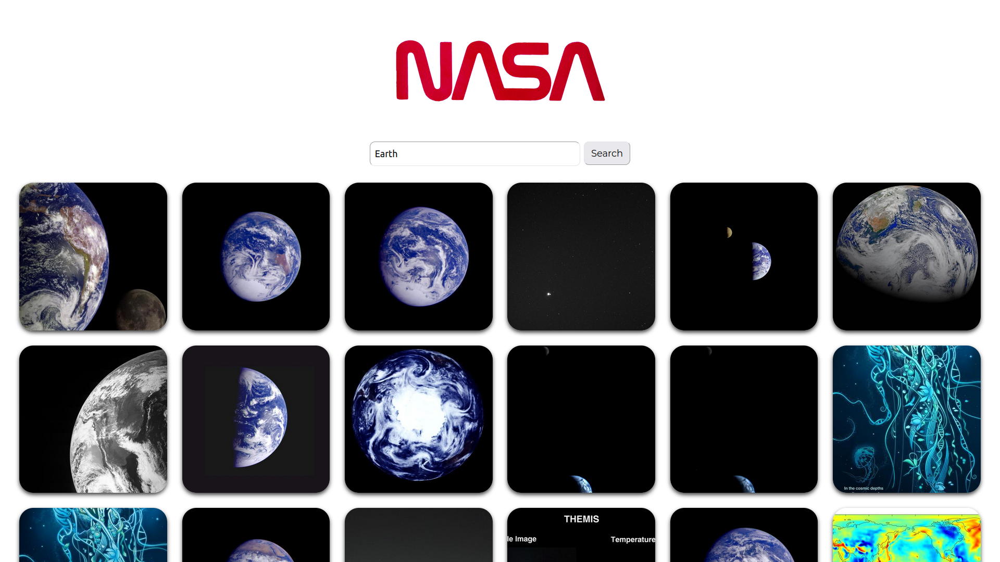

<h1>React Technical Test - NASA Search</h1>

 

This is an application built with create-react-app that allows users to search for images based on a query relating to space.

<h3>Testing Utilities</h3>
<ul>
  <li>Jest</li>
  <li>React Testing Library</li>
</ul>

<h3>Packages</h3>
<ul>
  <li>Axios</li>
</ul>

<h3>Getting Started</h3>
Clone the repository:
<pre><code>git clone https://github.com/joshk98/tech-test</code></pre>
Navigate to the project directory:
<pre><code>cd tech-test</code></pre>
Install the dependencies:
<pre><code>npm install</code></pre>
Start the application:
<pre><code>npm start</code></pre>

The app will be running at <a href="http://localhost:3000">http://localhost:3000</a>.

<h3>Features</h3>

This app allows you to search for images related to your query using the NASA API. It provides a user-friendly interface with a search form where you can enter your query and see the search results displayed as a collection of images. If no results are found, it shows a message indicating so. The app also includes a NASA logo for visual appeal.

<h3>Usage</h3>

To use the app, simply enter your search query in the search input field and click the "Search" button. The app will fetch and display relevant images based on your search query.

<h3>Contributing</h3>

Contributions are welcome! If you'd like to contribute to the Tech Test, please follow these guidelines:

<ul>
  <li>Fork the repository</li>
  <li>Create a new branch</li>
  <li>Make your changes</li>
  <li>Submit a pull request</li>
</ul>
